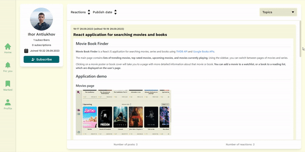
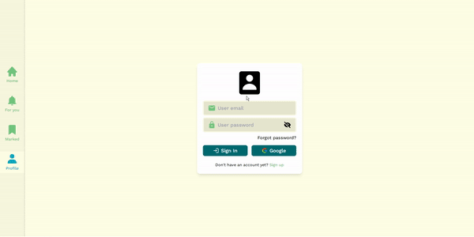

## Blog Hub App

**Blog Hub** is a React blogging app powered by Firebase.

In this application, **you can publish posts with Markdown formatting**, subscribe to other users and put reactions on posts, search for posts in the database, create as many users as you want and customize them, and much more.

**View profiles and posts of other users**, posts of people you follow, and posts you've marked. You can sort posts by the number of reactions and date of publication and filter them by topics.

[Try the app demo](https://blog-hub-app.web.app/) running on Firebase Hosting.

## Application demo

### Home page with posts from all users


### Other user's information and posts



### Authorization in the application



## Installation

1. Install Node.js *(in case you haven't installed it)*.
2. [Download the source code](https://github.com/IhorAntiukhov/blog-hub-app.git) and open a command prompt in the project's root folder.
3. Install the dependencies needed for the application.

```
npm install
```
4. Start React project and development server.

```
npm start
```

## Libraries and tools

This app was built using **Create React App**, **Redux Toolkit**, **Tailwind CSS**, **Class names** library and Firebase features such as Firestore, Storage, Authentication and Hosting.
